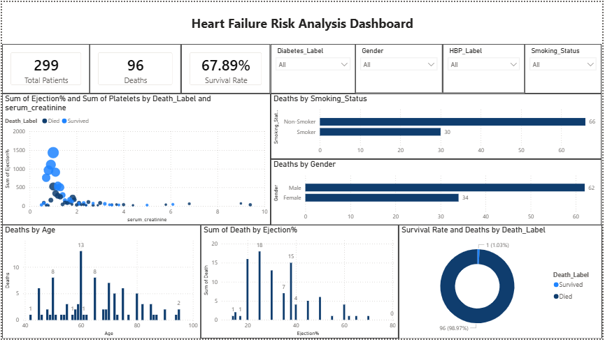

# Heart Failure Risk Analysis Dashboard

## Project Overview
This interactive dashboard provides a comprehensive analysis of **heart failure patient data** to uncover key factors affecting mortality risk and heart health outcomes. Through dynamic visualizations and filters, users can explore trends, identify high-risk groups, and support data-driven clinical insights.

---

## Dataset Description
The dataset contains clinical records of patients with heart failure and includes demographic, behavioral, and clinical measurements. Common features include:

- **Age** and **Gender**  
- **Ejection Fraction** – percentage of blood pumped from the heart  
- **Serum Creatinine** – kidney function indicator  
- **Creatinine Phosphokinase (CPK)** – enzyme level related to heart muscle damage  
- **Platelets** – blood clotting information  
- Presence of **Chronic Conditions** (e.g., Diabetes, High Blood Pressure)  
- **Smoking Status**  
- **Follow-up Time** (in days)  
- **Death Event** – whether the patient died during the follow-up period  

---

## Dashboard Screenshot
Here’s an example of the dashboard layout and visualizations:

> **Note:** Replace `dashboard.png` with the relative path to your actual dashboard image in the repository.

---

## Core Visualizations

### Key Performance Indicators (KPIs)
- Total number of patients  
- Total deaths  
- Calculated survival rate (%)  

### Interactive Filters
- Slicers for **Diabetes**, **Gender**, **High Blood Pressure**, and **Smoking Status** to segment patients and explore patterns.

### Scatter Plot
- X-axis: **Serum Creatinine**  
- Y-axis: **Ejection Fraction**  
- Bubble size: **Platelets**  
- Color-coded by **Death Event** (Died / Survived)  
*Purpose:* Identify patient clusters at high risk of heart failure mortality.

### Bar Charts
- Death counts by **Gender**  
- Death counts by **Smoking Status**

### Histograms
- Distribution of deaths by **Age**  
- Distribution of deaths by **Ejection Fraction (%)**

### Pie Chart
- Overall survival rate distribution (Died vs Survived)

---

## Insights and Use Cases
- Older patients and those with elevated serum creatinine combined with low ejection fraction show higher mortality risk.  
- Chronic conditions like diabetes or high blood pressure influence survival outcomes.  
- Smoking and gender differences are associated with variations in mortality.  
- Helps clinicians and researchers identify high-risk patient groups for closer monitoring or intervention.

---

## Data Preparation and Modeling
- Binary columns (Diabetes, Smoking, High Blood Pressure) are converted into readable categories (e.g., Yes/No, Smoker/Non-Smoker).  
- Survival rate is calculated as: Survival Rate = (Total Patients - Deaths) / Total Patients
- Data cleaning, transformation, and calculated fields are performed to support interactive filtering and accurate visualization.

© 2026 Priyanshu Singh Bisht – For educational use only
